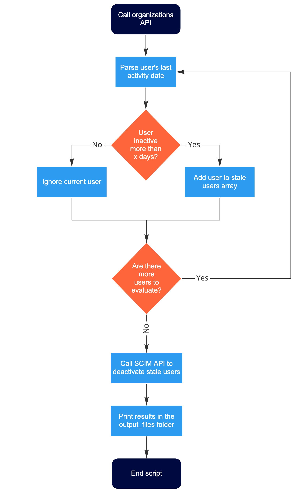

## Introduction

This example explains how to retrieve and deactivate inactive/stale users using Miro REST and SCIM APIs.

### Script flow


 
## Preparation

### Step 1. Ensure SCIM is enabled

- To use the app in this repository, SCIM must be enabled in the respective Miro account.

### Step 2. Clone the repo and install the dependencies

```bash
git clone https://github.com/MiroSolutionsEngineering/deactivate-stale-users.git
npm install
npm i file-system
```

### Step 3. Copy `.env` file

```bash
cp .env.example .env
```

### Step 4. Enable the SAM module in Miro

- This [guide](https://help.miro.com/hc/en-us/articles/4403963598226-Software-asset-management-with-Productiv#h_01F6429D4R9AMCCN7CR579TTTZ) shows how to get the SAM token.

- Add the received Miro OAuth SAM token in the `.env` file (this will be the `ORGANIZATIONS_API_KEY` in your `.env` file)

### Step 5. Get the SCIM API Token

- In your Miro account go to `Settings > Security` and copy the SCIM API token

- Add the Miro SCIM API token in the `.env` file


### Step 6. Adjust the number of days a user must be inactive to be considered as "stale"

- Within the file `index.js` locate line `180` and adjust the value of the variable `days`. By default it's set to 61 days.


### Step 7. Start Node server locally

```bash
npm start
```

## Expected results

Once the script runs the results will be available in the local folder `output_files`. There you will find the below files:

- `stale_users_(unique-timestamp)_.json`: An array of a stale users (before deactivation).

- `deactivated_users_(unique-timestamp)_.json`: An array of users that got successfully deactivated by the app.

- `conflict_users_(unique-timestamp)_.json`: An array of users that could not be deactivated because they are the last Team Admin in at least one of the Miro Teams they belong to. Since every Team within a Miro organization must have a least one Team Admin, the SCIM API returns a `409` error when attempting to deactivate a user that is the last Team Admin of a Team. This array of conflict users allows you to review manually and act accordingly.

- `other_failed_requests_(unique-timestamp)_.json`: An array of users that could not be deactivated due to other errors that are not `409` or `429`. The array contains detailed information about the failed request (such as: userId, email, request URL, error code, error message).

## Expected errors

The SCIM API can return the below **expected** errors:

- `409: Any account in organization must have at least one admin`: Received when the user to deactivate is the last Team Admin of a Miro Team. In this case a file named `conflict_users_(unique-timestamp)_.json` will be created within the folder `output_files` containing the users that could not be deactivated so you can review manually and act accordingly. 

- `429: Too many requests`: Received when the amount of requests made exeeds the SCIM API rate limit. When this occurs, the script automatically holds execution for 61 seconds and then resumes execution automatically, there is no action needed from your side. To learn more about Miro's SCIM API rate limits, click [here](https://developers.miro.com/docs/scim-rate-limits).

- `404: No resource with ID {user_id}`: Received when attempting to deactivate a user with the role `organization_external_user`. The SCIM API can only deactivate users with the role `organization_internal_user`. In this case, the affected users will be added to the file `other_failed_requests_(unique-timestamp)_.json` within the folder `output_files`. These users would need to be manually deactivated from the Miro User Interface or turned into internal users (after internal approval within your organization has been given).

- To see a full list of all possible errors, click [here](https://developers.miro.com/docs/errors).
